<!-- Cabeçalho / arte -->

  

Um desenvolvedor que transforma ☕ + ideias em código.

---

  <!-- Stats gerais -->
  

  <!-- Top Linguagens -->
  

---

## 👨‍💻 Sobre mim

- 🧠 Apaixonado por aprender novas tecnologias  
- 💻 Focado em **Frontend / Backend / Full-Stack**  
- 🔄 Sempre contribuindo para projetos open source  
- 🎮 Quando não estou codando: jogando e vendo anime  

---

## 🛠 Tecnologias que uso

| Área | Ferramentas / Linguagens |
|------|--------------------------|
| Frontend | HTML, CSS, JavaScript, React, Angular, Puppeteer |
| Backend | Node.js, Python, Express|
| Banco de Dados | MongoDB, PostgreSQL, MySQL |
| Outros | Git, Docker, CI/CD, APIs REST |

---

---

## 🤝 Vamos nos conectar

  <!-- Contador de visitas -->
  

> “Código é igual um disco riscado  
> – Povea
